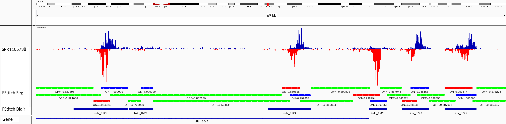

# Fast Read Stitcher (FStitch)
Fast Stitch Reader (FStitch) rapidly processes read coverage files into contigs of actie and inactive regions of transcription with its intended being primarily for refining annotations in nascent transcription data (GRO-seq, PRO-seq, NET-seq, etc.)<sup>1</sup>. Using FStitch, you can:

* Discover unannotated large regions of active transcription for enahncer and other non-coding RNA discovery
* Better annotate 5' and 3' ends of genes for differential transcription analysis and Tfit RNAPII modeling
* Filter regions of active transcriptional activity for downstream application (i.e. Tfit bidirectional predictions for enhancer identification)
* Differentiate and analyze genome-wide coverage of active transcription between treatment types
* Annotate bidirectional transcripts for differential transcription and motif displacement analayses

The following is an example of FStitch output:


*Integrative Genomics Viewer (IGV) snap shot demonstrates the annotations obtained using FStitch. Color ‘green’ indicates regions of inactive transcription (signal is not singificantly above background "noise"). Color ‘blue’ represents active transcription on the forward (pos) strand and ‘red’ on the reverse (neg) strand.*


## System Requirements
The `train` and `segment` modules of FStitch are written in C++ whereas the extension `bidir` module is written in Python.  With this in mind, users will need to have Python 3 and a GCC compiler later than version 5.4 to compile and run FStitch. To check you compiler version in \*nix, enter the following into the command line: 
```
$ gcc —-version
$ g++ —-version
```
Note, for those running FStitch on a compute cluster, commonly you will need to perform a ‘module load gcc<version>’ to compile FStitch. Please ask your sys admins for questions on module load behavior.
    
### Setup

FStitch is now avilable via conda. To install via the conda package manager:
```
conda install -c dowell-lab fstitch
```

Alternatively, you can clone the FStitch repository. If your gcc compiler is up to date, you can compile FStitch by moving into the cloned repository directory and running

```
$ sh setup.sh
=========================================
Sucessfully Compiled
```

In short, the setup.sh just runs “make clean” and "make" in the src/ directory. If everything compiles, you should see "Sucessfully Compiled" at the end. Importantly, you will now see the executable “FStitch” in the src directory.

***NOTE: fstitch-bidir is now deprecated. The PyPi repo (fstitch-bidir) still exists for version control, but to install the latest version, FStitch bidir is now nested in fstitch-annotate with other submodules***

The `fstitch-annotate` extension is written in Python 3, and the module and its requirements are most easily installed using pip

```
pip3 install fstitch-annotate --user
```

Alternatively, the user can run setup.py located in the /FStitch/fsannotate directory as follows:

```
$ python3 setup.py
```

## General Usage
Here are the minimum commands needed to run FStitch from start to finish; for greater detail on usage and file types see below. 
```
$ FStitch train -b </path/to/sample.bedGraph> -s (+/-) -t </path/to/TrainingFile>  -o </path/to/Parameters.hmminfo>

$ FStitch segment -b </path/to/sample.bedGraph> -s (+/-) -p </path/to/Parameters.hmminfo> -o </path/to/segmentFile.bed>

$ bidir -b </path/to/sample.bedGraph> -g </path/to/gene_annotations.bed> -o </path/to/bidir_annotations.bed>
```

## Running FStitch

The Fast Read Stitcher program is divided into two main commands: `train` and `segment` 
* `train`: estimates the necessary probabilistic model parameters
* `segment`: uses the output model parameters and segments the entire genome into *active* and *inactive* regions of transcription

To view the usage statement, use following standard arguments (must be compiled!):
```
$/src/FStitch -h 

$/src/FStitch --help
```

### Coverage File (bedGraph) Format Requirements

The provided coverage file must be in bedGraph format (See the UCSC description<sup>2</sup>) which is a BED4 file where the fourth column represents coverage over the annotated start/end positions. For example:

```
chr    start    end    coverage
1      0        100     3
1      107      117     1
```

***IMPORTANT***

Your .bedGraph file **should not contain 0 values** and should be **non-normalized**. FStitch performs an internal normalization.

There are two main tools for generating bedGraph coverage files from BAM files, deepTools and BEDTools. By default, deepTools bamCoverage will have discrete bins (50bp) and will therefore calculate average coverage over regions, rather that contigs of regions with equal read coverage, and "smooth" the data. While this is not a problem for visualizaiton at smaller bins, it will conflict with normalization. Therefore, we recommend using default BEDtools<sup>3</sup> genomecov settings:
    
```
$ bedtools genomecov -ibam <file.bam> -g <file.bedGraph> -bg -s <+/->
```

Specifying five prime (-5 argument) in the “genomecov” may allow for cleaner annotations however unspecified five prime bed works just fine as well. 

Often times, it is useful to merge the positive and negative strands for conversion to TDF if you are using IGV as your genome browser so you can view both strands on one track. While FStitch will only train and segment one strand at a time, you can provide this concatenated pos/neg bedGraph file as long as it is formatted with appropriate integers in the fourth column (i.e. -\<integer> for a negative strand coverage region). FStitch will remove regions based on which ever stand you specify in the -s/--strand argument. An example of how to generate an appropriately formatted concatenated pos/neg bedGraph file is as follows:

```
awk 'BEGIN{FS=OFS="\t"} {$4=-$4}1' ROOTNAME.neg.bedGraph \
 > ROOTNAME.neg.formatted.bedGraph

cat \
 ROOTNAME.pos.bedGraph \
 <(grep -v '^@' ROOTNAME.neg.formatted.bedGraph) \
 | sortBed \
 > ROOTNAME.sort.cat.bedGraph
```

Note that the last command, sortBed, will require BEDTools. This is not required for FStitch, but is good practice as it will process quicker and is required for conversion to TDF if so desired.


## FStitch train
FStitch uses two probabilistic models to classify regions of high read density into "active" transcriptional regions: Logistic Regression (LR) and a Hidden Markov Model (HMM). The LR coefficients are estimated via a user defined label training file. Because we are classifying regions as signal or noise, FStitch requires regions of the genome that show characteristic transcription or high read dense profiles and regions of the genome that display noise or not a profile of nascent transcription or a read dense region. With this information, FStitch trains a logistic regression classifier and then couples it to a HMM. The transition parameters for the Markov model are learned via the Baum Welch algorithm and thus do not require user labeled training data.  

In short, FStitch requires regions the user considers active transcription and regions considered inactive (noise). The more regions provided to FStitch the more accurate the classifications however we have in Cross Validation<sup>1</sup> analysis that roughly 15-20 regions of active and inactive regions will yield accurate classifications. 

### Training file Format

These regions are provided to FStitch using a specific file format with four columns separated by tabs: chromosome, genomic coordinate start, genomic coordinate stop, (0 if “noise” or 1 “signal”). An example is given below:

```
~/TrainingFile.bed
chr    start    end     label
1      1000     6000    1 
1      6001     8250    0
13     13500    19000   0
13     21000    23000   1
```

The segments do not need to be in any order and can be from any chromosome, however ***each region must not overlap any other segment*** as this will cause confusion in the learning algorithms for the LR classifier. This makes sense -- calling a region as both "ON" and "OFF" in binary world is confusing. 

**Very important**: If FStitch is being used on stranded data, the bedGraph file used in the `train` must correspond to the strand indicated in the *TrainingFile.bed*. For example, if the strand in the training file comes from the forward strand but the user supplies a bedGraph file that is on the reverse strand, then learned parameters will not be accurate. 

### Training File Options : Using provided annotations or manually annotating samples

There are two options provided in producing a training file for FStitch:
1. Use the pre-configured 'univerisal' training file provided (only available for hg38 currently)
2. Manually annotating active/inactive regions for your sample

The simplest approach (option 1) to training is to utilize the pre-configured training file (in FStitch/train).  The pre-configured training file, available for the human genome version hg38 only, contains annotations of twenty ubiquitously expressed genes and twenty intergenic regions on the sense (pos/+) strand. In our experience, these regions provide reasonable initial training for most high quality data sets, e.g. sufficiently complex and sequenced to appropriate depth.  However, custom training data (described below) typically improves FStitch performance. 

When using the pre-configured training data, it is recommended that the user first check that the default regions regions have adequate coverage in their specific dataset using BEDTools genomecov:

```
$ bedtools genomecov -bams [SAMPLE BAMS] -bed hg38_annotations.bed > sampleCoverage.bed
```

Regions of zero read coverage should be removed, but care should be taken not to remove too many regions as this dramatically reduces training effectiveness.  We recommend that no more than 5 "OFF" and 5 "ON", for a total of ten regions, can be discarded.  In our experience, the pre-configured training data is effective when all "active" regions have coverage and the overall read depth over "active" and "inactive" regions is over 10:1 after normalizing for bin size (total reads /(end-start)).  If the pre-configured training file fails these standards, the sample should be assessed for quality as the data may have insufficient sample depth or complexity.

For best results, a custom training file should be created.  The training data file can be generated from scratch or build upon the provide pre-configured training set.   We will describe both methods and provide recommendations regarding its construction. 

Creating a training dataset from scratch requires identifying regions of both "active" and "inactive" signal within the data.   For this, we recommend utilizing the Broad's Integrative Genomics Viewer (IGV).   While you can import mapped read files (typically BAM or bedGraph files) directly into IGV, numerous large files can decrease IGV's performance.   As such, we recommend that the user convert the bedGraph file to TDF format, which is a binary form of the bedGraph tailored for faster access. To convert the bedGraph to a TDF, utilize IGV tools with the following command: 

```
$ igvtools toTDF SRR.cat.bedGraph SRR.cat.tdf genome.chrom.sizes 
```

where the file genome.chrome.sizes is a chromosome size file that corresponds to the genome to which your samples were mapped, obtained either from UCSC or provided with IGV tools.  Alternatively, you may convert the bedGraph within the IGV browser by selecting: 
 
```
Tools --> Run igvtools ... 
```

from the top drop-down menu and specifying the same minimum arguments used in the command above. 

Once the samples have been converted to TDF format and loaded into IGV, it is best practice to begin by looking at annotated genes that are highly expressed in the data of interest to become familiar with the typical read distribution patterns of "active" regions compared to "inactive" (or noise) regions.  It is recommended that the user select between 15-20 inactive regions and 15-20 active regions.

While the user can build the required BED4 file manually, it is also possible to take advantage of IGV's built in capacity for collecting a table of regions.   The coordinates for the current field of view within IGV can be added to an ongoing list using the top down menu:

```
Regions --> Region Navigator ...
```

which will open a table with the necessary four columns: chromosome, start, end, and description. By clicking the "Add" button at the top, the current region shown will be added (chromosome, start and end) with the "Description" column remaining empty.  In this description column, the user must add the status of the region, either a "0" or "1" for inactive ("OFF) or active ("ON) transcription respectively.  Once multiple regions have been added to the table, the set of annotations can be exported by selecting:

```
Regions --> Export Regions ...
```

and choosing where to save the training file and under what to name (must end in .bed). The file will be saved in the required BED4 format, so no further editing is required before running FStitch `train`.  Likewise, the pre-configured training regions file can be imported into IGV by going to the top drop-down menu in the program and selecting:

```
Regions --> Import Regions ...
```

Regions can then be added, edited, or removed from the list to tailor the training file to your specific data using the Region Navigator, as described previously.

#### Training Tips

Annotating regions of "active/singal" and "inactive/noise" transcription ("ON" and "OFF") and generating a desirable training file typically requires a little bit of trial-and-error. That said, the following are some tips to expedite the learning process.

##### Avoid "over-fitting"
If your aim is to segment your sample into long contigs (e.g. for improving 5' and 3' gene annotation), it is best **not to over-fit**, or in other words provide too many training examples. If you provide >40 regions, you will get noticably larger BED file output files as a result of increasing the number of segments, or "contigs". In other words, the more regions you prodide, the more you simply obtain regions where coverage = 0 is "OFF" and any coverage > 0 is "ON". We don't need FStitch to give us this information.

##### Try to pick large training regions
If you annotate training regions that are <1000bp, there will likely not be enough annotated regions of coverage in the given bedGraph file to accurately calculate the LR coefficients. Try to pick a mixture of regions between 1b and 50kb for training.

##### Do not pick "dead zones"
For regions you annotate as "OFF", be sure to include regions that have some background signal, or "noise". Remember, you will be training using your bedGraph file, so if you pick regions that have "0" coverage and you followed the instructions above for coverage file formatting, you will not be providing FStitch any regions to assess. FStitch will try to account for data "gapiness" or the distance between read coverage regions, and therefore the more "background" (think of ChIP input controls) you can provide it, the better FStich will be able to distinguish the "noise" from the "activity".

### Running the module

Running FStitch train is simple once you have your coverage data in the correct format and have created the training file above. The following is a description of arguments:

**Required Arguments**

|Flag|Type|Desription|
|----|----|----------|
|-b  --bedgraph| \</path/to/BedGraphFile>              | bedGraph File from above
|-s  --strand  | \<+/->                                | Specifes which strand (pos/neg) you trained on <br> **NOTE: You can only train on ONE strand!**</br>
|-t  --train   | \</path/to/TrainingFile.bed>          | Training File from above (BED4 format)
|-o  --output  | \</path/to/outDir/Parameters.hmminfo> | Training Parameter OutFile (.hmminfo extension)

**Optional Arguments**

|Flag|Type|Desription|
|----|----|----------|
|-n  --threads | \<integer>                            | number of processors, default 1

An example command is therefore:

    $ FStitch train -b </path/to/BedGraphFile.bedGraph> -s (+/-) -t </path/to/TrainingFile.bed> -o </path/to/Parameters.hmminfo>

The output will be a *Parameters.hmminfo* file that will store the learned parameters for the LR and the HMM transition parameters needed in `segment`. Here's an example of what the training file *Parameters.hmminfo* should look like.

```
####################################################
#                  Fast Read Stitcher
#Parameter Estimation Output
#Command Line                    :~/FastReadStitcher/src/FStitch train -s + -b bedgraphs/SRR000001.bedGraph -t fstitchTrain.bed -o Dowell2018.hmminfo
#Date/Time                       :2018-10-26 12:13:16
#Learning Rate                   :0.400000
#Max Iterations                  :100.000000
#Convergence Threshold           :0.001000
#####################################################
Converged                        :True
Final LogLikelihood              :-3530.215862
Logistic Regression Coefficients :1.013783,0.000000,-0.001297,186.575328
HMM Transition Parameter         :0.933049,0.066951,0.021232,0.978768
~
```

## FStitch segment
FStitch `segment` uses the parameters obtained from `train` (from above, \</path/to/Parameters.hmminfo>) as input, as well as the original bedGraph file. A description of the arguments are given below.

**Required Arguments**

|Flag|Type|Desription|
|----|----|----------|
|-b  --bedgraph     | \</path/to/sample.bedGraph>           |BedGraph File Format from above
|-s  --strand       | \<+/->                                |Specifes which strand (pos/neg) you wish to segment <br> **NOTE: You can only segment on ONE strand at a time!**</br>
|-p  --params       | \</path/to/Parameters.hmminfo>        |Training parameters prduced from train module
|-o  --output       | \</path/to/segFile.bed>               |Your output segmentFile.bed (BED9 format)

**Optional Arguments**

|Flag|Type|Desription|
|----|----|----------|
|-n  --threads      | number                                |number of processors, default = 1

An example of the command is therefore:

    $ FStitch segment -b </path/to/bedGraphFile> -s (+/-) -p </path/to/Parameters.hmminfo> -o </path/to/segFile.bed>

This will produce a file called segmentFile.bed, and can be imported into any genome browser)

Note you can use your parameter out file from FStitch train (i.e. Parameters.hmminfo) to segment other datasets in the same series of samples from an experiment. In fact, using the same parameter out file will gurantee consistency and comparibility across datasets, so this is encouraged. 

*That said*, remember that FStitch attempts to discern "noise" from "signal". Therefore, if you have a sample that has low complexity (i.e. it is difficult to distinguish signal from noise), you may either want to train using other samples, perform deeper sequencing on this sample (i.e. obtain a technical replicate -- this may be especially necessary depending on your downstream analysis interests), or train this sample separately (reduces strength of a statistical comparison between samples). As such, sample of comperable complexity and read depth will typically behave the best in FStitch.

## FStitch bidir



The FStitch `bidir` extension module (beta version) uses the output from `segment` to annotate regions of bidirectional transcripts. The positive and negative strand data generated from `segment` needs to be concatenated and sorted using BEDTools prior to running the `bidir` module which can be achieved as follows:

```
$ cat segFile.pos.bed segFile.neg.bed | sortBed > segFile.cat.bed
```

The following are the required and optional arguments:

**Required Arguments**

|Flag|Type|Desription|
|----|----|----------|
|-b  --bed         | \</path/to/segFile.cat.bed>           |FStitch segment output (BED file), concatenated for both postive and negative strands.
|-g  --genes       | \</path/to/gene_annotations.bed>      |Path to gene annotations (e.g. RefSeq gene annotations, BED format).
|-o  --output      | \</path/to/bidirs.bed>                |Path and filename for bidir module output (BED format).

**Optional Arguments**

|Flag|Type|Desription|
|-------|----|----------|
|-tss  --removetss   |                |Adding this flag will remove transcription start sites from output. <br>Default = False</br>
|-s    --split       |                |This will split the output into additional short and long bidirectionals. <br>Default = False</br>
|-f    --footprint   | \<Integer>     |The footprint is a gap between positive and negative reads, proposedly due to polymerase loading. This function will add an integer value (in bp) to merge positive and negative segments that do not overlap. This value should likely be increased for lower complexity data and will have minimal effect for high complexity data.<br> Default = 300.</br>
|-lg   --mergelength | \<Integer>     |Length (in bp) for short/long merge length.Short and long calls are segregated and merged separately to prevent short calls from being merged into long bidirectional regions (e.g. superenhancers, unanoated genes/lncRNAs).<br>Default=12000</br>
|-lm   --maxlength   | \<Integer>     |Integer value (in bp) for max reported bidirectional length. <br>Default=25000</br>
|-ls   --splitlength | \<Integer>     |Choose length (in bp) for short/long bidirectional file split. Only an option if -s flag is specified. <br>Default=8000</br>
|-p    --plotdidirs  |                |Generate a histogram plot for bidirectional lengths. <br>Default = False</br>

The minimum arguments are therefore as follows:

```
$ bidir -b </path/to/sample.bedGraph> -g </path/to/gene_annotations.bed> -o </path/to/bidir_annotations.bed>
```

#### Additional argument description

There are a number of optional arguments that allow the user to parse the output according to annotation length as well as adjust the length at which calls are merged. Long regions are merged separately from short regions to avoid losing discrimination of smaller bidirectional annotations. Annotated regions >8000bp tend to be indicative of unannotated genes, lncRNAs, and super-enhancers. If the user only intends to perform motif displacement analyses, it is recommended that these larger regions be segregated using the --split option. Furthermore, because many of these "short" and "long" bidirectionals will overlap as a result of separate merging, it is also recommended that the user merge all desired calls when performing differential transcription analysis so as not to drastically increase the degrees of freedom.

#### Stats file output format

The stats file produce is tab-delimited with the following run information (in order from left to right):

footprint, max length of bidir call, **split length (short and long calls)**, fstitch positive segments, fstitch negative segments, dropped short bidirs, dropped long bidirs, intragenic bidirs, intergenic bidirs, mean bidir length, median bidir length, **total "short" bidirs (based on split length if specified)**, **total "long" bidirs (based on split length if specified)**, total bidirectionals annotated

where the bolded stats are only present if the used specifies the -s/--split argument.

#### Usage in Tfit

While the annotated bidirectionals can be used for the aforementioned analyses, they can also be used as a rigorous prefilter for modeling bidirectionals using Tfit `model` (https://github.com/Dowell-Lab/Tfit) thereby serving as an alternative to the Tfit `prelim` module. This may be especially useful for long regions of super-enhancers as Tfit can model multiple bidirectionals, or predicted RNA polymerase (RNAP) loading sites, within a single annotated region. Furthermore, Tfit's `model` module will produce additional modeling parameters that will describe RNAP activity at the sites provided including loading, pausing, and elongation.

## FStitch Expand

***REQUIRES BEDTools (https://bedtools.readthedocs.io/en/latest/)***

The FStitch `expand` extension module will generate *transcriptional* annotations for each gene. In other words, using a gene annotation file and FStitch `segment` output, the `expand` module will determine which genes are "active" by takings counts over the gene annotated transcription start sites (TSSs) and merging gene annotations and transcriptionally "ON"/active contigs. If the 3' end runs into another transcriptionally active gene, the run-on will be truncated before the next TSS by subtracting the window calculated by the -r/--radius argument from the segment data. As such, this module is also useful for filtering gene annotation lists into "active" and "inactive", a useful application for differential trancription analysis. See example below.


The positive and negative strand data generated from `segment` needs to be concatenated and sorted using BEDTools prior to running the `bidir` module which can be achieved as follows:

```
$ cat segFile.pos.bed segFile.neg.bed | sortBed > segFile.cat.bed
```

#### Gene annotation file format and output file format

By default, a RefSeq BED12 gene annotation file downloaded from the UCSC table browser will only contain the accession number in the 4th column. However, if you download and concaenate standard gene names (name2 in custom table selection) with the 4th column accession number (e.g. NM_00000000_MYGENE), these will automatically be split and the output file will be in a pseudo BED6 format, but the 5th column (normally score) will contain the gene name (name2). If the default BED12 is used, a filler value of 0 will be used in the 5th column.

The following are the required and optional arguments:

**Required Arguments**

|Flag|Type|Desription|
|----|----|----------|
|-b  --bed         | \</path/to/segFile.cat.bed>        |FStitch segment output (BED file), concatenated for both postive and negative strands.
|-c  --cram        | \</path/to/sorted.cram>            |Mapped CRAM/BAM file. Both file types supported, although CRAM is recommended. Will need to export path to reference genome if using CRAM (see BEDTools reference).
|-g  --genes       | \</path/to/gene_annotations.bed>   |Gene reference file in BED6(+) format. Only the first 6 columns will be used which must be in standard chr, start, end, name, score, strand format.
|-o  --output      | \</path/to/outdir>                 |Path to desired output directory. Temporary files will also be saved here (.tmp).

**Optional Arguments**

|Flag|Type|Desription|
|-------|----|----------|
|-s    --save        | BOOL           |Save list of active genes and original annotated regions (prior to merging/expanding using FStitch). <br>Default = False</br>
|-r    --radius      | \<Integer>     |Radius around the transcription start site (TSS) for which counts will be generated to determine activity. Note that higher values will take longer and potentially reduce contig length (see description of module for details). <br> Default = 1500. (**RECOMMENDED**)</br>
|-m   --mincount    | \<Integer>      |Minimum number of counts on the opposite strand required to be considered active. <br>Default=10.</br>

## Cite
If you find the Fast Read Stitcher program useful for your research please cite:

Joseph Azofeifa, Mary A. Allen, Manuel Lladser, and Robin Dowell. 2014. __FStitch: a fast and simple algorithm for detecting nascent RNA transcripts.__ In Proceedings of the 5th ACM Conference on Bioinformatics, Computational Biology, and Health Informatics (BCB '14). ACM, New York, NY, USA, 174-183. DOI=10.1145/2649387.2649427 http://doi.acm.org/10.1145/2649387.2649427


## References 
1. Joseph Azofeifa, Mary A. Allen, Manuel Lladser, and Robin Dowell. 2014. __FStitch: a fast and simple algorithm for detecting nascent RNA transcripts.__ In Proceedings of the 5th ACM Conference on Bioinformatics, Computational Biology, and Health Informatics (BCB '14). ACM, New York, NY, USA, 174-183. DOI=10.1145/2649387.2649427 http://doi.acm.org/10.1145/2649387.2649427   
2. http://genome.ucsc.edu/goldenpath/help/bedgraph.html
3. http://bedtools.readthedocs.org/en/latest/
4. http://openmp.org/wp/

