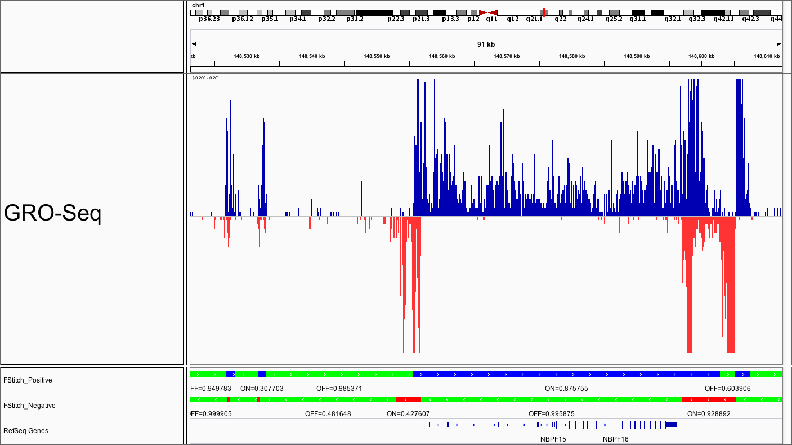

# Fast Read Stitcher (FStitch)
Fast Stitch Reader (FStitch) rapidly processes read coverage files into contigs of actie and inactive regions of transcription with its intended being primarily for refining annotations in nascent transcription data (GRO-seq, PRO-seq, NET-seq, etc.)<sup>1</sup>. Using FStitch, you can:

* Discover unannotated large regions of active transcription for enahncer and other non-coding RNA discovery
* Better annotate 5' and 3' ends of genes for differential transcription analysis and Tfit RNAPII modeling
* Filter regions of active transcriptional activity for downstream application (i.e. Tfit bidirectional predictions for enhancer identification)
* Differentiate and analyze genome-wide coverage of active transcription between treatment types



*Integrative Genomics Viewer (IGV) snap shot demonstrates the annotations obtained using FStitch. Color ‘green’ indicates regions of inactive transcription (signal is not singificantly above background "noise"). Color ‘blue’ represents active transcription on the forward (pos) strand and ‘red’ on the reverse (neg) strand.*

## General Usage
Here are the minimal commands needed to run FStitch from start to finish; for greater detail on usage and file types see below. 
```
$ FStitch train -b </path/to/BedGraphFile> -s (+/-) -t </path/to/TrainingFile>  -o </path/to/Parameters.hmminfo>

$ FStitch segment -b </path/to/forward/BedGraphFile> -s (+/-) -p </path/to/Parameters.hmminfo> -o </path/to/Annotations.bed>
```

## System Requirements
FStitch is written in the C++ programming language, with C++11 support and uses OpenMP<sup>4</sup> to support multi-threading.  With this in mind, users will need to have a GCC compilers later than version 4.7 and < 7.1.0 to compile and run FStitch. To check you compiler version, 
```
$ gcc —-version
$ g++ —-version
```
Note, for those running FStitch on a compute cluster, commonly you will need to perform a ‘module load gcc<version>’ to compile FStitch. Please ask your sys admins for questions on module load behavior.
    
### Setup

Download the FastReadStitcher/ directory from this url or clone to your local machine. If your compiler is up to date, you can compile FStitch by moving into the FastReadStitcher/ directory and running 
```
$ sh setup.sh
=========================================
Sucessfully Compiled
```
In short, the setup.sh just runs “make clean” and "make" in the src/ directory. If everything compiles, you should see "Sucessfully Compiled" at the end. Importantly, you will now see the executable “FStitch” in the src directory.

## Running FStitch

The Fast Read Stitcher program is divided into two main commands: `train` and `segment` 
* `train`: estimates the necessary probabilistic model parameters
* `segment`: uses the output model parameters and segments the entire genome into *active* and *inactive* regions of transcription

To view the usage statement, use following standard arguments (must be compiled!):
```
$/src/FStitch -h 

$/src/FStitch --help
```

### Coverage File (bedGraph) Format Requirements

The provided coverage file must be in bedGraph format (See the UCSC description<sup>2</sup>) which is a BED4 file where the fourth column represents coverage over the annotated start/end positions. For example:
    
chr    start    end    coverage
1      0        100     3
1      107      117     1

***IMPORTANT***
Your .bedGraph file **should not contain 0 values** and should be **non-normalized**. FStitch performs an internal normalization.

There are two main tools for generating bedGraph coverage files from BAM files, deepTools and BEDTools. By default, deepTools bamCoverage will have discrete bins (50bp) and will therefore calculate average coverage over regions, rather that contigs of regions with equal read coverage, and "smooth" the data. While this is not a problem for visualizaiton at smaller bins, it will conflict with normalization. Therefore, we recommend using default BEDtools<sup>3</sup> genomecov settings:
    
```
$ bedtools genomecov -ibam <file.bam> -g <file.bedGraph> -bg -s <+/->
```

Specifying five prime (-5 argument) in the “genomecov” may allow for cleaner annotations however unspecified five prime bed works just fine as well. 


## FStitch train
FStitch uses two probabilistic models to classify regions of high read density into "active" transcriptional regions: Logistic Regression (LR) and a Hidden Markov Model (HMM). The LR coefficients are estimated via a user defined label training file. Because we are classifying regions as signal or noise, FStitch requires regions of the genome that show characteristic transcription or high read dense profiles and regions of the genome that display noise or not a profile of nascent transcription or a read dense region. With this information, FStitch trains a logistic regression classifier and then couples it to a HMM. The transition parameters for the Markov model are learned via the Baum Welch algorithm and thus do not require user labeled training data.  

In short, FStitch requires regions the user considers active transcription and regions considered inactive (noise). The more regions provided to FStitch the more accurate the classifications however we have in Cross Validation<sup>1</sup> analysis that roughly 15-20 regions of active and inactive regions will yield accurate classifications. 

### Training file Format

These regions are provided to FStitch using a specific file format with four columns separated by tabs: chromosome, genomic coordinate start, genomic coordinate stop, (0 if “noise” or 1 “signal”). An example is given below:

chr    start    end     label
1      1000     6000    1 
1      6001     8250    0
13     13500    19000   0
13     21000    23000   1

The segments do not need to be in any order and can be from any chromosome, however **each region must not overlap any other segment** as this will cause confusion in the learning algorithms for the LR classifier. 

Running FStitch train is simple once you have your data in the correct format and have created the training file above. A description of the parameters for FStitch train are given below

|Flag|Type|Desription|
|----|----|----------|
|-b --bedgraph| \</path/to/BedGraphFile> | bedGraph File from above
|-s --strand| \<+/-> | Specifes which strand (pos/neg) you trained on **You can only train on ONE strand!**
|-t --train| \</path/to/TrainingFile.bed> | Training File from above (BED4 format)
|-o --output| \</path/to/outDir/Parameters.hmminfo> | Training Parameter OutFile (.hmminfo extension)
|-n --threads| \<integer> | number of processors, default 1

Putting this together
```
$ FStitch train -b </path/to/BedGraphFile> -s (+/-) -t </path/to/TrainingFile.bed>  -o </path/to/Parameters.hmminfo>
```
This will produce the a fie called anyName.out that will store the learned parameters for the logistic regression and HMM transition parameters need in “FStitch segment”. Below is one such output for anyName.out


Very important: If FStitch is being used on stranded data, the BedGraph file used in the “FStitch train” command must correspond to the strand indicated in the TrainingFile. For example, if the strand in the training file comes from the forward strand but the user supplies a BedGraph file that is on the reverse strand, then learned parameters will not be accurate. 

### Training Tips

Annotating regions of "active" and "inactive" transcription ("ON" and "OFF") and generating a desirable training file typically requires a little bit of trial-and-error. That said, the following are some tips to expedite the learning process.

##### Avoid "overtraining"
If your aim is to segment your sample into long contigs (e.g. for improving 5' and 3' gene annotation), it is best **not to overtrain**, or in other words provide too many training examples. If you provide >40 regions, you will get noticably larger .bed output files as a result of increasing the number of segments, or "contigs". In other words, the more regions you prodide, the more you simply obtain regions where coverage = 0 is "OFF" and any coverage > 0 is "ON". We don't need FStitch to give us this information.

##### Try to pick large training regions
If you annotate training regions that are <1000bp, there will likely not be enough annotated regions of coverage in the given bedGraph file to accurating calculate the LR coefficients. Try to pick a mixture of regions between 1b and 50kb for training.

##### Do not pick "dead zones"
For regions you annotate as "OFF", be sure to include regions that have some background signal, or "noise". Remember, you will be training using your bedGraph file, so if you pick regions that have "0" coverage and you followed the instructions above for coverage file formatting, you will not be providing FStitch any regions to assess. FStitch will try to account for data "gapiness" or the distance between read coverage regions, and therefore the more "background" (think of ChIP input controls) you can provide it, the better FStich will be able to distinguish the "noise" from the "activity".

## FStitch segment
FStitch segment follows from FStitch train and takes as input the TrainingParameterOutFile (from above, \</path/to/anyName.out>) as input, along with the original BedGraph file. A description of the parameters for FStitch segment are given below

|Flag|Type|Desription|
|----|----|----------|
| -i	| \</path/to/BedGraphFile> |BedGraph File Format from above
| -k 	| \</path/to/anyName.out> |Training Parameter Out File from FStitch train call
| -o	| \</path/to/anyName.bed> |A bed file that gives the regions considered active nascent transcription (or ChIP-seq peak) and noise
| -np 	| number |number of processors, default 8

Putting this together
```
$ /src/FStitch segment -i \</path/to/BedGraphFile\> -j \</path/to/anyName.out> -o \</path/to/anyName.bed> 
```
This will produce a file called anyName.bed, and can be imported into any genome browser)

Note you can use your parameter out file from FStitch train (i.e. anyName.out) to segment other datasets. In fact, using the same parameter out file will gurantee consistency and comparibility across datasets, so this is encouraged.

## Cite
If you find the Fast Read Stitcher program useful for your research please cite:

Joseph Azofeifa, Mary A. Allen, Manuel Lladser, and Robin Dowell. 2014. __FStitch: a fast and simple algorithm for detecting nascent RNA transcripts.__ In Proceedings of the 5th ACM Conference on Bioinformatics, Computational Biology, and Health Informatics (BCB '14). ACM, New York, NY, USA, 174-183. 

##References 
1. Joseph Azofeifa, Mary A. Allen, Manuel Lladser, and Robin Dowell. 2014. __FStitch: a fast and simple algorithm for detecting nascent RNA transcripts.__ In Proceedings of the 5th ACM Conference on Bioinformatics, Computational Biology, and Health Informatics (BCB '14). ACM, New York, NY, USA, 174-183. DOI=10.1145/2649387.2649427 http://doi.acm.org/10.1145/2649387.2649427   
2. http://genome.ucsc.edu/goldenpath/help/bedgraph.html
3. http://bedtools.readthedocs.org/en/latest/
4. http://openmp.org/wp/

